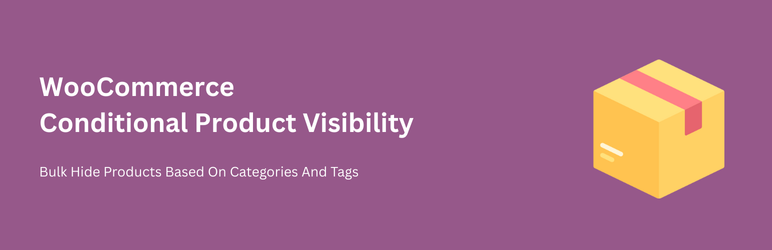
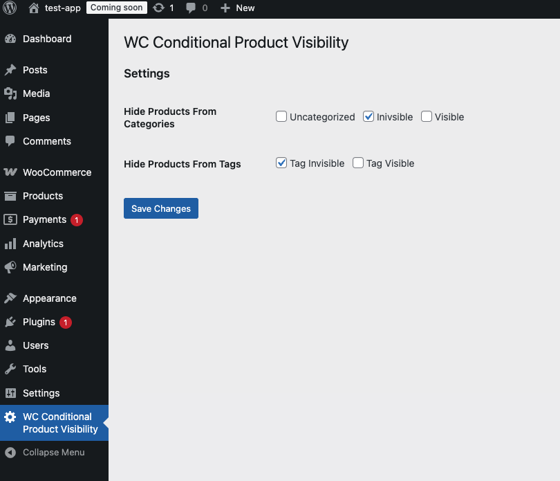

# WC Conditional Product Visibility
WordPress WC Conditional Product Visibility

## Hide WooCommerce Products Based On Category Or Tag From Listing Page & Product Page
This plugin lets site admin to bulk hide products from both product listing page and a single product pages if they belong to one of the categories or tags.

## Settings

### Settings View
Select categories and tags. Products that belong to these categories or tags will be hidden.

### Product View
Display the available list of products as well as categories and tags they belong to

### Frontend Store View
Only products that don't belong to selected categories or tags are visible

